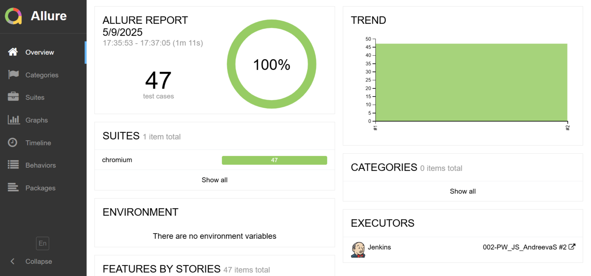
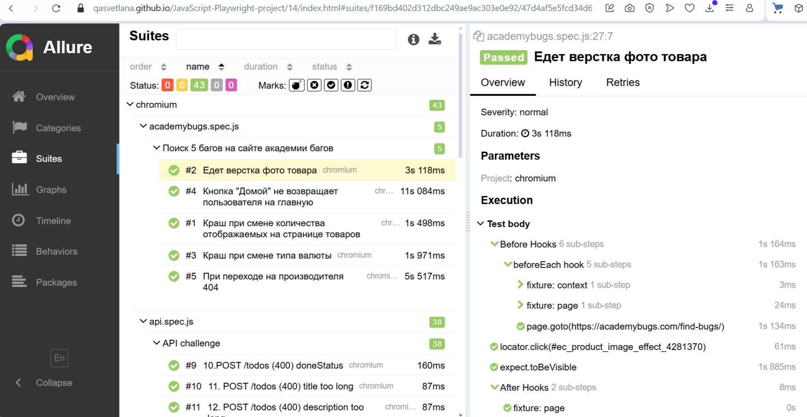
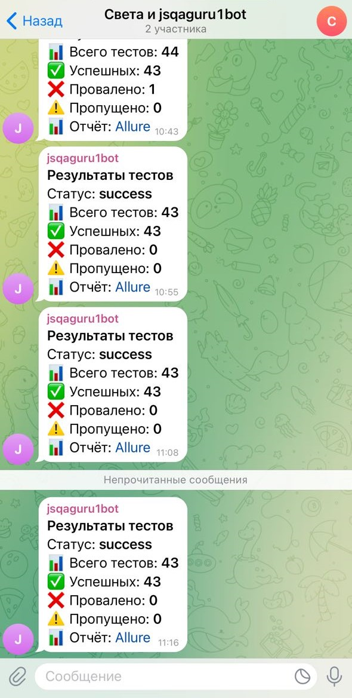
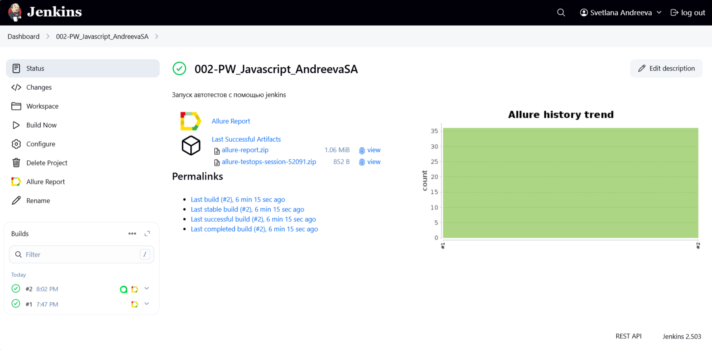
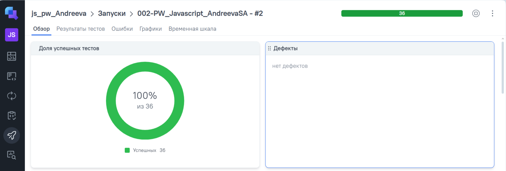
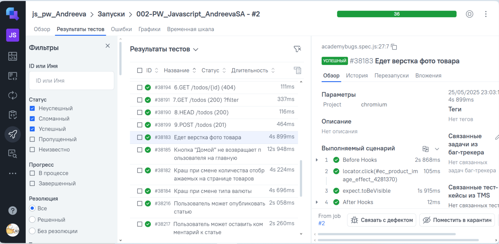

#  UI- и API-автотесты на Playwright + JavaScript


37 автотестов для трёх публичных стендов: UI-сценарии на Page Object, API-тесты через сервисный слой, генерация данных на faker, прогон в GitHub Actions, отчёт Allure в GitHub Pages и уведомление в Telegram.

## Что покрыто

| Набор | Стенд | Тестов | Что проверяется |
| --- | --- | --- | --- |
| UI · `tests/conduit.spec.js` | [realworld.qa.guru](https://realworld.qa.guru/) | 3 | регистрация нового пользователя в `beforeEach`, публикация статьи, комментарий, лайк |
| UI · `tests/academybugs.spec.js` | [academybugs.com](https://academybugs.com/find-bugs/) | 5 | воспроизведение известных багов стенда: краш при смене количества товаров и валюты, съехавшее фото товара, кнопка «Домой», 404 на странице производителя |
| API · `tests/api.spec.js` | [apichallenges.herokuapp.com](https://apichallenges.herokuapp.com/) | 29 | методы GET, HEAD, POST, PUT, DELETE, OPTIONS; коды 200, 201, 400, 404, 406, 413; валидация полей и длины, ответы в XML и JSON |

## Стек

Playwright 1.52 · JavaScript (ES-модули) · @faker-js/faker · Allure Report (allure-playwright) · GitHub Actions · Jenkins · Allure TestOps · Telegram-бот

## Структура

```
src/
  pages/conduit/        Page Object для realworld.qa.guru
  pages/academybugs/    Page Object для academybugs + общий объект App
  service/              сервисный слой API: challenger, challenges, todos, todo
  helpers/builder/      билдеры тестовых данных на faker: пользователь, статья
  helpers/fixtures/     фикстура app для academybugs (test.extend)
tests/                  спеки: conduit, academybugs, api
.github/workflows/      CI: прогон, Allure в GitHub Pages, уведомление в Telegram
```

Приёмы, на которые стоит посмотреть:

- в academybugs тесты получают страницы через общий объект `App` из фикстуры, а не создают page object в каждом тесте;
- API-тесты не собирают запросы руками — это делает сервисный слой;
- данные собираются билдером: `new UserBuilder().addEmail().addUsername().addPassword(11).generate()`;
- токен челленджера получается один раз в `beforeAll`;
- у API-тестов теги по методу и номеру задания: `@GET`, `@POST`, `@id_9`;
- ретраи и trace включаются только в CI: `retries: 2`, `trace: 'on-first-retry'`.

## Как запустить

Нужен Node.js 18 или новее.

```bash
git clone https://github.com/QASvetlana/JavaScript-Playwright-project.git
cd JavaScript-Playwright-project
npm ci
npx playwright install chromium
```

```bash
npm test                               # все тесты
npx playwright test tests/api.spec.js  # только API
npx playwright test --grep @POST       # по тегу
npm run testui                         # UI-режим Playwright
```

Тесты ходят на внешние стенды, поэтому нужен интернет.

## Отчёты

```bash
npm run reportAwesome   # Allure 3, отчёт одним HTML-файлом
npm run reportClassic   # классический вид Allure
```

[Allure-отчёт прогона в CI](https://qasvetlana.github.io/JavaScript-Playwright-project/) — публикуется в GitHub Pages вместе с историей запусков.





## CI

Workflow «pw tests with allure» запускается вручную: **Actions → pw tests with allure → Run workflow**. Он ставит зависимости и браузеры, гоняет тесты, публикует Allure-отчёт в GitHub Pages и отправляет сводку в Telegram. Для Telegram нужны секреты `TELEGRAM_BOT_TOKEN` и `TELEGRAM_CHAT_ID`.


Сводка прогона в Telegram:



Альтернативный запуск в Jenkins:



Интеграция с Allure TestOps:



